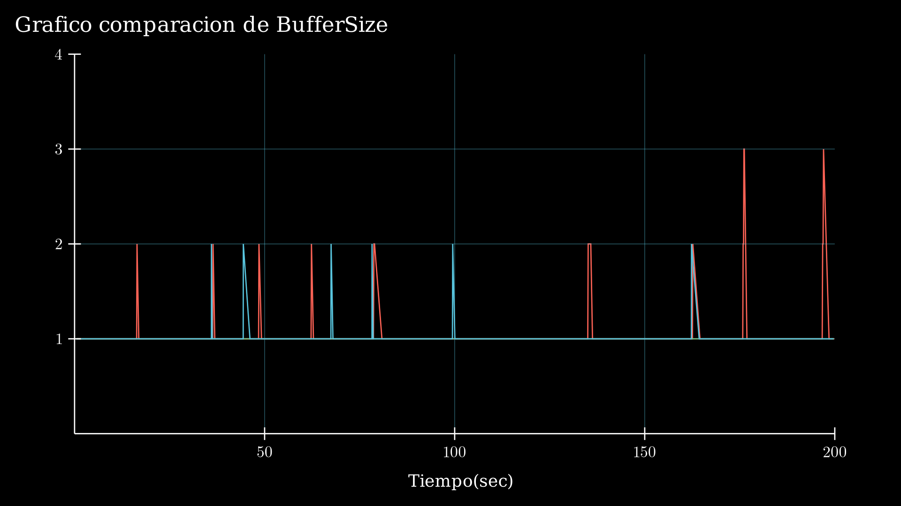

(No recomendamos ver desde bitbucket)
# Informe 

### Integrantes
- Joaquin Dubois 
- Mateo Ricci Villaruel
- Santiago Miranda

## Introduccion 
EL tema de estudio tratado a continuacion gira en torno a la utilizacion de canales con diferente tasa de transferencia y bufferes a lo largo de un Network construido a partir de un servidor y un recepctor con una cola en medio 

Lo que nos dio pie a tratar dos temas importantes a la hora del diseño de una red

* Control de Flujo 
* Control de Congestion 

Nuestra red consta de estos modulos simples

 
1. Gen : Referenciando a la foto de arriba, este seria la canilla que manda agua por la tuberia, es el que regula la cantidad de informacion que se manda

2. Queue : Un modulo intermedio por el cual pasa la conexion, puede almacenar una cantidad limitada de paquetes antes de dropear informacion

3. Sink  : Referenciando a la foto de arriba, este seria el cubo donde llega la informacion, en nuestra simulacion no tiene una cantidad de paquetes que puede acumular, en terminos de redes reales nuestro receptor tiene un buffer ilimitado 

Donde estos modulos contruyen nuestro network 

1. Gen -> Queue = **NodeTx** : Una combinacion de un generador comun con una queue 

2. Queue = **Queue** : Una queue normal 

3. Queue -> Sink = **NodeRx** : Una combinacion de una queue con un sink comun 

## 1era Parte 

Nuestro primero experimento nace de ver como se comporta la queue intermedia al recibir packets de NodeTx en una determinada velocidad y siendo capaz solo de "mandar" otra cantidad determinada a NodeRx, visto con las mediciones:

### Primer caso 

| <!-- --> | <!-- --> |
|:---------|---------:|  
| **NodeTx("out") -> Queue("in")**       | datarate=1Mbps - delay=100us  |   
| **Queue("out") -> NodeRx("in")**       | datarate=1Mbps - delay=100us  |
| **NodeRxQueue("out") -> SInk("in")**   | datarate=0.5Mbps - delay=100us|

Una primera impresion sobre el network desemboca en que la queue asociada al nodeRx no va a ser capaz de mandar la informacion recibida hacia el sink, causando que cuando la queue llene su buffer de datos, dropee paquetes -> _mas precisamente cada dos paquetes que lleguen uno se va a perder_

Veamos los graficos designados para cada **GenerationInterval** y corroboremos esta primera hipotesis

    Al tener una conexion menor en una de las lineas comparado a la totalidad del network y tener un problema de congestion/**flujo** , los paquetes toman cada vez mas en llegar porque al saturarse en un buffer, algunos paquetes tardan en ser entregados o directamente no son entregados. Un GenInterval rapido no deja a la componente mas lenta liberarse de la data que le llega, evidentemente en un momento la tabla no muestra cosas sobre archivos dropeados ya que el sink no puede realizar el calculo para sacar el tiempo de vida que estuvo en network 

___

  
  

    La grafica imprime 0 cuando no se pierde un paquete y un 1 cuando se pierde, por eso parece un rectangulo normal, pero si damos un vistaso a los ultimos seg de la grafica agrandados (foto a su derecha) vemos que desde un punto (seg = 42 primer drop) pierde un paquete y manda otro, basicamente como dijimos antes, cada dos paquetes se pierde uno 

___ 

    Esta tabla esta escalada porque la cantidad de paquetes mantenida en el `NodeTxQueue` (Color Rojo) es **considerablemente** mas grande que las otras queue (mas o menos una escala del 1 a 0.2 comparada con las otras dos lineas, ya que esta queue llegaba a tener >1000). Ademas de eso se puede ver que el `NodeRxQueue` (Color Azul) que se ve afectada por tener la mitad de data transfer va subiendo linealmente y cuando llega a la totalidad de su capacidad, se queda casi constante ya que siempre tiene 200 (saca uno y entra uno). Por ultimo el `Queue` (Color Verde) tiene en general 0 paquetes de su buffer, ya que no bien llega un paquete se lo manda a `NodeRxQueue` 
    

    La conexion sigue teniendo los mismos data transfer, pero esta vez el GenInterval es 0.5 (numero escogido para ver que pasa cuando el gen no satura la red). El resultado era de esperarse, una linea que se mantiene en un intervalo [0 ; 1,1] ya que al no tener un cuello de botella por una generacion muy rapida de paquetes, la linea siempre mueve paquetes a una velocidad que la menor data transfer puede manejar 

    No hay perdida de paquetes, reflejado un poco en el delay de los mensajes, nunca un paquete se queda estancado en un modulo/queue

    En el `NodeTxQueue` (Color Rojo) es el unico modulo donde se llega a una cantidad de 3 paquetes, pero en general para el `NodeRxQueue` (Color Azul) y el `Queue`(Color Blanco) se mantiene entre 1 y 2, de nuevo reafirmando que no se produce el cuello de botella normal con GenInterval 0.1l

### Segundo caso 

| <!-- --> | <!-- --> |
|:---------|---------:|
| **Generation Interval**                | 0.1  |  
| **NodeTx("out") -> Queue("in")**       | datarate=1Mbps - delay=100us   |   
| **Queue("out") -> NodeRx("in")**       | datarate=0.5Mbps - delay=100us |  
| **NodeRxQueue("out") -> SInk("in")**   | datarate=1Mbps - delay=100us   | 

Analizando esta distribucion en las tasas de transferencia, se puede deducir que el queue no va a poder "sacarse" paquetes a una velocidad suficiente para que el generador no sature su buffer -> _A razon de sacar un paquete del queue cuando llegan dos del generador_

    Al tener una conexion menor en una de las lineas comparado a la totalidad del network y tener un problema de **congestion**/flujo , los paquetes toman cada vez mas en llegar porque al saturarse en un buffer, algunos paquetes tardan en ser entregados o directamente no son entregados. Un GenInterval rapido no deja a la componente mas lenta liberarse de la data que le llega, evidentemente en un momento la tabla no muestra cosas sobre archivos dropeados ya que el sink no puede realizar el calculo para sacar el tiempo de vida que estuvo en network  

___

  
  

    La grafica imprime 0 cuando no se pierde un paquete y un 1 cuando se pierde, por eso parece un rectangulo normal, pero si damos un vistaso a los ultimos seg de la grafica agrandados (foto a su derecha) vemos que desde un punto (seg = 42 primer drop) pierde un paquete y manda otro, basicamente como dijimos antes, cada dos paquetes se pierde uno 

___

{width='400px'}

    Esta tabla esta escalada porque la cantidad de paquetes mantenida en el `NodeTxQueue` (Color Rojo) es **considerablemente** mas grande que las otras queue (mas o menos una escala del 1 a 0.2 comparada con las otras dos lineas, ya que esta queue llegaba a tener >1000). Ademas de eso se puede ver que el `Queue` (Color Verde) que se ve afectada por tener la mitad de data transfer va subiendo linealmente y cuando llega a la totalidad de su capacidad, se queda casi constante ya que siempre tiene 200 (saca uno y entra uno). Por ultimo el `NodeRxQueue` (Color Azul) tiene en general 0 paquetes de su buffer, ya que no bien llega un paquete de la Queue se lo saca de encima hacia el sink 

___

    La conexion sigue teniendo los mismos data transfer, pero esta vez el GenInterval es 0.5 (numero escogido para ver que pasa cuando el gen no satura la red). El resultado era de esperarse, una linea que se mantiene en un intervalo [0 ; 1,1] ya que al no tener un cuello de botella por una generacion muy rapida de paquetes, la linea siempre mueve paquetes a una velocidad que la menor data transfer puede manejar 

___

    No hay perdida de paquetes, reflejado un poco en el delay de los mensajes, nunca un paquete se queda estancado en un modulo/queue

___

    En el `NodeTxQueue` (Color Rojo) es el unico modulo donde se llega a una cantidad de 3 paquetes, pero en general para el Queue (Color Blanco) y el `NodeRxQueue`(Color Azul) se mantiene entre 1 y 2, de nuevo reafirmando que no se produce el cuello de botella normal con GenInterval 0.1 

### Preguntas 

¿Qué diferencia observa entre el caso de estudio 1 y 2? ¿Cuál es la fuente limitante en cada uno? 

La principal diferencia (previamente mencionada en el analisis de los dos casos de estudios) es el cambio en la tasa de transferencia de la queue al nodeRx y de la queue de nodeRx al sink en cada respectivo caso de estudio

El detonante de este estudio es la perdida de paquetes, pero la misma puede ser provocada por dos problematicas 

- Flujo 
- Congestion 

1. La primera se provoca cuando un emisor rapido satura el buffer del receptor, pensandolo como una transmision tuberia, el emisor manda datos a una velocidad a la cual el emisor no puede registrar, ordenar o delegar a la aplicacion destinada, en el primer caso de estudio si consideramos al nodeRx en su totalidad como el receptor de esta transferencia de datos, la perdida ocurre en esa instancia, por lo que podria clasificarse como problema de flujo 

2. La segunda, la cual esta vinculada a sobrecargar la memoria de un puerto pasajero en la transmision del archivo, en nuestro caso de estudio 2 nuestra queue del medio no tiene buffer ilimitado, asi que al tener una tasa de trasnferencia mas chica en su puerto out que en su puerto in causa una perdida de paquetes incluso antes de entrar al nodeRx

## 2da Parte

Nos planteamos mejorar el network de manera que el receptor pueda comunicarse con el emisor, esto **podria** ser la solucion a nuestro problema en el caso de estudio 1 y 2, pero solamente implementando ademas de esta linea de comunicacion un algoritmo que limite la velocidad a la que los paquetes llegan 

Pero eso es problema para mas adelante, primero vino la implementacion de unas nuevas clases simples a nuestra creacion de network 

Nuestra nueva red consta de estos nuevos modulos simples 

1. TransportTx : Se podria decir que es una mejora a nuestra simple queue de antes, esta tendra un campo de input de donde recibira los paquetes transmitidos por el generador y un campo inout haciendo referencia a un canal donde sale y entra informacion, esta conexion out esta conectada con la queue del medio del network para transmitir **solamente** paquetes del tipo 1 (_pronto se explicara que significa esto_) y por su linea in recibira **solamente** paquetes  del tipo 2 del nuevo queue agregado al network 
2. TransportRx : Su estructura es similar a la de TransportRx, pero esta cuenta con un campo output, conectada con el sink para pasar la informacion llegada y como en el anterior otro campo inout, donde el in de la conexion es para recibir paquetes del tipo 1 y 2 de la queue vieja del network, mientras que su campo out esta conectado a la queue nueva del network que **solamente** transmite paquetes del tipo 1 

Pero que son estos nuevos paquetes y porque es importante diferenciarlos de simplemente paquetes como antes? 

Bueno, algunos paquetes seguiran siendo como antes, paquetes con informacion que tienen como destino al sink 

Pero otros seran paquetes cargados con feedback que hara que el emisor regule la velocidad a la que esta transmitiendo paquetes para asi lograr el mejor funcionamiento de la red en conjunto 

### Algoritmo de control de la red 

Empezamos pensando en que algoritmos implementar para controlar tanto el problema del flujo como el de congestion, asi que nos inclinamos a utilizar uno provisto por la catedra del teorico, pero **cual**?

Parada y espera es el mas simple, pero creemos se estaria perdiendo la mayor parte del uso de la red esperando mensajes de confirmacion etc 

Por lo tanto la otra opcion es arranque lento, pero la idea de perder un paquete para que el algoritmo empiece a hacer algo no nos parecia la mejor, asi que usamos la idea de un umbral (al 75 por ciento de la capacidad del buffer afectado por el cuello de botella) donde al llegar a este umbral dicho queue va a soltar un feedback del tipo adecuado para regular el mandado de paquetes en transportTx

Como estamos en una simulacion y los data transfers solamente estan para hacer un calculo y obtener el tiempo que va a tardar el servicio en estar completo, podemos alterar este tiempo multiplicando por escalares (en particular 3) haciendo que el serviceTime sea mayor (o menor) regulando asi la carga del buffer que no puede mover los paquetes lo suficientemente rapido, veamoslo mas detenidamente 

1. Ingresamos 3 tipos de paquetes -> 1 = data , 2 = bajar data trasfer , 3 = subir data transfer  
2. Los handleMessage de Queue y TransportRx son similares, ya que cumplen la misma funcion, llevar el mensaje de feedback a travez de la queue 2 hacia el transportTx (queue inserta el feedback justo antes del frente del buffer para que no choque o trate de transmitirlo mientras un paquete esta viajando, en cambio transportRx simplemente los linkea a su salida de queue 2 porque nunca va a haber paquetes fluyendo por ahi )
3. El feedback es recibido como msg en trasportTx donde handleMessage decifra de que tipo de mensaje se refiere con el metodo getKind 
4. Si es de tipo 2 o 3 debera alterar el service time calculado, en nuestro caso multiplicado por 3 (es decir, el scheduleado setteara el evento 3 veces mas tarde) o dividiendolo por 3 si el buffer de la queue llego a un nivel aceptable y puede volver a el data transfer normal 
5. El network no pierde paquetes! (por lo menos no para nuestros casos de estudio)

    Tratando de interpretar la grafica sobre el ( tiempo de creacion - el tiempo de llegada ) al tener nuestro algoritmo que baja el data transfer (enrealidad simplemente con respecto al service time calculado le multiplicamos un escalar como dijimos antes) creemos que por eso la linea de delay queda constante con respecto a los dos ejes 

    Esta componente es mas interesante, ya que vemos un cambio drastico con respecto a los graficos de la parte 2 de nuevo tenemos la cantidad actual de paquetes de los 3 Queue, De nuevo tenemos escalado a  `NodeTxQueue` (Color Rojo) y esta vez se ven fluctuaciones (bajadas) solo en algunas partes, ya lo vamos a relacionar con las demas capacidades. El `Queue` (Color Azul) se mantiene en 0 por la misma razon, que en la parte 1, le llegan paquetes a una velocidad que se puede sacar de encima inmediatamente. Pero veamos que paso con `NodeRxQueue` (Color Verde) Hay unos picos en 150  y otros picos en 90, que significa esto? 
    Son los umbrales Max/Min que definimos para nuestro programa, cuando la cantidad del buffer de `NodeRxQueue` llegan al 75% de su capacidad mandan el feedback que hablamos y `NodeTxQueue` baja la velocidad de mandado por 3, esas fluctuaciones en `NodeTxQueue` que habiamos mencionados son producidas por las partes en las que el Queue afectado por la data transfer menor llega a su Umbral Min le manda otro feedback para que se reanude la conexion normal 

___

    Tratando de interpretar la grafica sobre el ( tiempo de creacion - el tiempo de llegada ) al tener nuestro algoritmo que baja el data transfer (enrealidad simplemente con respecto al service time calculado le multiplicamos un escalar como dijimos antes) creemos que por eso la linea de delay queda constante con respecto a los dos ejes 

    Esta componente es mas interesante, ya que vemos un cambio drastico con respecto a los graficos de la parte 2 de nuevo tenemos la cantidad actual de paquetes de los 3 Queue, De nuevo tenemos escalado a  `NodeTxQueue` (Color Rojo) y esta vez se ven fluctuaciones (bajadas) solo en algunas partes, ya lo vamos a relacionar con las demas capacidades. El `NodeRxQueue` (Color Verde) se mantiene en 0 por la misma razon, que en la parte 1, le llegan paquetes a una velocidad que se puede sacar de encima inmediatamente. Pero veamos que paso con `Queue` (Color Azul) Hay unos picos en 150  y otros picos en 90, que significa esto? 
    Son los umbrales Max/Min que definimos para nuestro programa, cuando la cantidad del buffer de `Queue` llegan al 75% de su capacidad mandan el feedback que hablamos y `NodeTxQueue` baja la velocidad de mandado por 3, esas fluctuaciones en `NodeTxQueue` que habiamos mencionados son producidas por las partes en las que el Queue afectado por la data transfer menor llega a su Umbral Min le manda otro feedback para que se reanude la conexion normal

## Conclusiones

Logramos solucionar el problema de control de flujo y el problema de congestion con la misma implementacion, es decir generalizamos a un metodo que pueda arreglar los dos problemas 
Para cualquier valor razonable desde { 4 < buffer } no se pierden paquetes (ya que el setteo de un umbral para un valor menor a 4 resultaria en que los dos umbrales sean el mismo o el feedback no llega a tiempo )

El laboratorio fue muy ilustrativo sobre como funciona una conexion vista como tuberia y vista como una red conjunta, lo que enriquecio los conocimientos previamente estudiados en el teorico 

Espero que el informe haya sido de su agrado y agradecemos su atencion 

ATTE grupo03 

