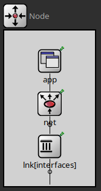

# Informe 

## Introduccion 
A diferencia del anterior laboratorio que se ubicaba en la capa de transporte y todos los problemas que tiene que manejar esta capa, ahora bajamos una capa y nos ubicamos en la capa de red mas especificamente, ponemos una lupa en la queue del medio del anterior lab que servia para darnos el ejemplo de problema de congestion

Pero hagamos una breve introduccion de esta red y las problematicas que resuelve para la entrega de paquetes

En la capa de transporte la comunicacion se suele ver como una tuberia, donde la info va de extremo a extremo, el viaje o enrutamiento son cosas que la capa de transporte no regula y ahi es donde entra la capa de red. Esta capa ve la tuberia como un grafo donde debe darle una ruta al paquete tomando en cuenta, embotellamientos y routers que dejan de operar para cierta red 

El laboratorio nos presenta una red la cual tiene forma de anillo la cual esta constituida por 8 nodos (referidos a si mismo como node[i] para el i-esimo nodo)

Este nodo por dentro esta formado de la siguiente manera 

* App : Actua como emisor o como receptor o no toma accion alguna en el viaje de paquetes, basicamente si el paquete enviado tiene como destino este nodo la app toma el paquete 

* Net : Es el encargado de enrutar los paquetes que le llegan tomando en cuenta el algoritmo de enrutamiento que se haya implementado, los componentes de mas abajo no tienen decision acerca donde mandar los paquetes, solamente este puede decidir que hacer con ellos

* Lnk[0] y lnk[1] : simples mecanismos con dos tareas, sacar el paquete del nodo si viene de Net o subir el paquete para Net si viene de afuera del nodo

## Parte 1 
En esta primera parte usamos el enrutamiento proveido por la catedra con el fin de sacar metricas que ayuden a entender que problema tiene un implementacion simple 

Como es esta implementacion? Simplemente el modulo Net chequea si el paquete que llego tiene de destino su app, sino lo manda a la derecha en sentido horario 

Simple no? 

Pues si, pero esto tambien trae algunas consecuencias a la hora de usar nuestra red. Veamos un par de metricas sobre dos casos de estudio en particular y saquemos conclusiones acerca de estas metricas 

### Caso 1 
(node[0] y node[2] transmitiendo datos a node[5])
En este primer caso de estudio, el node 2 y el 0 mandan paquetes con destino node 5 

En la foto se puede ver que un bufferSize del node[0]lnk[0] crece con el tiempo, esto debido a que es el lugar mas concurrido de la red, recibe mensajes de la izquierda creados por el node[2] y ademas el mismo crea mensajes que van para la izquierda con destino node[5]

una grafica no tan interesante pero si marca la ruta tomada por los paquetes dependiendo de si tiene source node[2] o node[0] 

Se puede ver que el delay crece, pero ademas de eso hay altos y bajos en su subida, esto producto de que la creacion de paquetes en el node[2] siempre va vivir mas tiempo en el anillo de nodos debido a que esta escencialmente mas lejos que el node[0] el cual es la contraparte de los bajos en la subida del delay 

- ¿Cómo es el uso de los recursos de la red? 

El uso de los recursos de la red son ineficientes, porque los paquetes eligen el mismo lado por el cual ir, dejando a los nodes[3,4]
totalmente inactivos 

- ¿Se puede mejorar?

Si, se podria hacer que el node[2] mande por la derecha y el node[0] mande por la izquierda, de esta forma ningun lnk estaria en una sobrecarga por la creacion y llegada de paquetes 

### Caso 2 
Asuma ahora que todos los nodos (0,1,2,3,4,6,7) generan tráfico hacia el node[5] con un **IntervalArrivalTime** de 1 (el normal)

Elegimos como muestreo los 4 nodes donde la cantidad de paquetes fue la menor, la mayor y una equilibrada entre estos dos valores 

Se puede ver que los puntos caen en numeros enteros, evidentemente haciendo ilusion a la cantidad de saltos que dio el paquete para llegar a su destino 

El delay crece, esta vez con incluso mas altos y bajos a la hora de su subida, capaz estas irregularidades opacadas por la rapida subida, este es el peor caso que se puede tener en nuestra red con el algoritmo propuesto por la catedra

---
### Caso 2 IntervalFixed

Elegimos usar un InterArrivalTime de 6 y vemos que el buffer de los lnks y el delay de los paquetes se estabiliza, pero porque? Basicamente la creacion de paquetes ocurre con una velocidad lo suficientemente lenta como para que nunca haya un punto donde los paquetes se acumulan, ya que apenas llegue uno, el tiempo que transcurre hasta que llega otro es mayor a la velocidad en la que el buffer se saca el primer paquete de encima 

Estos estan contenidos en un conjunto de valores ya que nunca llegan a quedarse en algun lugar estancados 

Algo similar con el delay, ya no esta la crecida de la grafica pero siguen estando los altos y bajos, los altos por el node[4] dando toda la vuelta y los bajos por el node[6]

## Parte 2
En esta parte usamos un enrutamiento basado en distancia, si vemos nuestra red, notaremos que solo hay un node (el node[1]) que produce cierto nivel de ambiguedad con este algoritmo, ya que para los dos lados tiene exactamente 4 saltos hasta llegar a su destino, veamos como repercute en los anteriores casos de estudio. Las formalidades del algoritmo se veran en el video presentado

### Caso 1

Vemos que hay una mejora considerable, ya que no existe un camino donde dos paquetes generados por diferentes nodes se encuentran, ademas de que el unico node sin utilizar es el node[1] (puesto que seria contraproducente tomar ese camino con el algoritmo seleccionado )

El porque es obvio, el node[0] elige ir por la derecha, donde el node[2] elige la izquierda 

Es de esperarse qeu no existan loops en el enrutamiento ya que el algoritmo seleccionado nunca dejaria que un paquete haga una ruta que le permita hacer un loop (ya que si existe un loop, hay un camino mas corto que seria seguir los mismos pasos hasta el loop pero no hacerlo y seguir por el final del loop hasta el destino)

### Caso 2 

## Conclusion

Luego de ver los resultados y mejorias impuestas por nuestro algoritmo, queda pensar, existe algun algoritmo que sea mas eficiente y general? 

La respuesta es si, pero hablemos de esas dos cualidades por separado 

- Eficiencia:

Si consideramos nuestra red anillo y los casos de estudio tratados en el informe, no podria haber alguna mejora de eficiencia con otro algoritmo, ya que al ser una red tan simple, las decisiones a tomar siempre se limitan a derecha o izquierda. Pero esto es considerando la red anillo que tenemos 

- General: 

El algoritmo que diseñamos no es muy general para alguna red que no tenga la forma de un anillo , en el sentido en que, algunos grafos mas complicados no solamente tienen salidas 0 y 1 representando izquierda o derecha, sino que algunos grafos presentan mas de 4 interfacez por las cuales los paquetes pueden navegar

Si usamos por ejemplo un Caso de estudio donde dos nodes de el mismo hemisferio le transmiten a el node[5], veremos que tenemos el mismo problema que cuando haciamos el caso de estudio 1 con el enrutamiento dado por la catedra

Los dos elegirian el camino mas corto hacia su destino y este seria el mismo lado, causando embotellamiento en el node mas cercano al destino 

ATTE grupo12 
